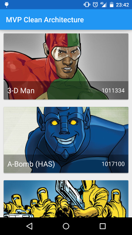
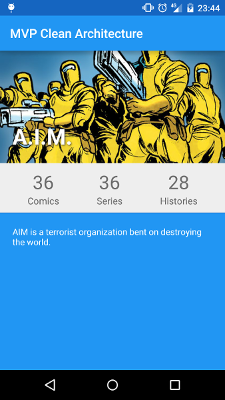
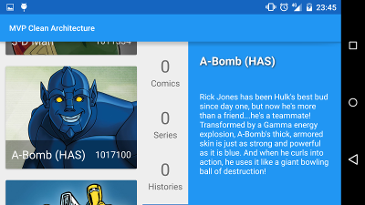

MVP Clean Architecture
==

A sample project using Clean architecture and MVP

## Motivation

Auto learning and make an example of Clean Architecture with MVP are the principal motivation for this app

Inspired by the project [EffectiveAndroidUI](https://github.com/pedrovgs/EffectiveAndroidUI) by @pedrovgs that I fully recommend

Clean architecture
------------

The Clean architecture search to make independent our code from data sources, UI, Frameworks, etc.

Make more testable the code

MVP
------------

Model view presenter is one of the most used architectural pattern, in Android this pattern can be used with a few limitations, Activities and Fragments have more responsibility than a simple view, anywhere is a wonderfull pattern to be used in Android applications.

Apllication structure
------------

//TODO

External Libs
------------

This project use this external libs

* [Retrofit ](http://square.github.io/dagger/)
* [Dagger](http://square.github.io/retrofit/)
* [ButterKnife](http://jakewharton.github.io/butterknife/)
* [Parceler](https://github.com/johncarl81/parceler)
* [Picasso](http://square.github.io/picasso/)

Screenshots
------------

Developer By
------------

Adrián García Lomas

* [Twitter](https://twitter.com/glomadrian)
* [LinkedIn](https://es.linkedin.com/in/glomadrian )

License
-------

Copyright 2014 Adrián García Lomas

Licensed under the Apache License, Version 2.0 (the "License");
you may not use this file except in compliance with the License.
You may obtain a copy of the License at

http://www.apache.org/licenses/LICENSE-2.0

Unless required by applicable law or agreed to in writing, software
distributed under the License is distributed on an "AS IS" BASIS,
WITHOUT WARRANTIES OR CONDITIONS OF ANY KIND, either express or implied.
See the License for the specific language governing permissions and
limitations under the License.
